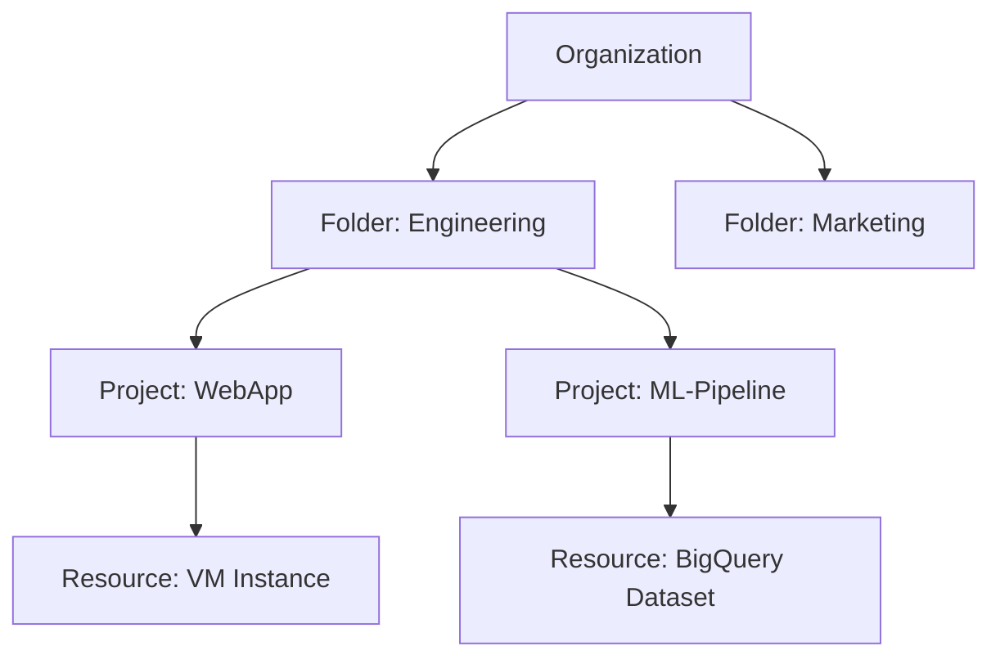
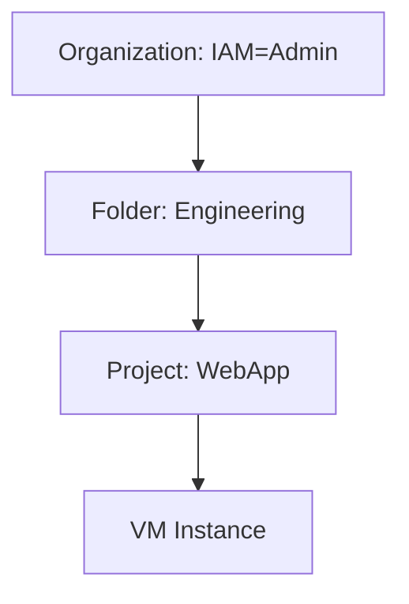
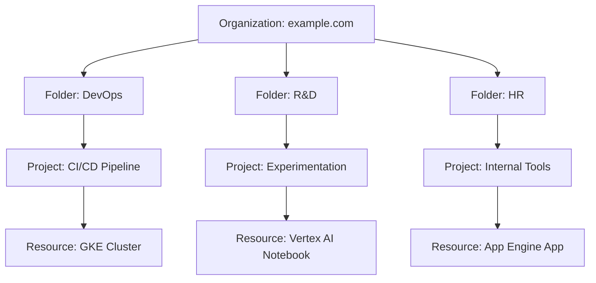

# The Ultimate Guide to Understanding GCP Resource Hierarchy

Google Cloud Platform (GCP) is a powerful cloud ecosystem offering a variety of services for developers, startups, and enterprises alike. But before diving into these services, there's one crucial concept to master: GCP Resource Hierarchy.

When I first started working with GCP, understanding its resource structure was one of those "aha!" moments that made everything else click into place. The resource hierarchy isn't just an organizational chart—it's the backbone of your entire cloud infrastructure that impacts security, billing, and operational efficiency.

This article will help you deeply understand how GCP organizes resources, manage access, and maintain control across projects with a clear, catchy, and visual explanation. Whether you're a solo developer or managing an enterprise architecture, getting this hierarchy right is essential.

## Table of Contents

- [The Ultimate Guide to Understanding GCP Resource Hierarchy](#the-ultimate-guide-to-understanding-gcp-resource-hierarchy)
  - [Table of Contents](#table-of-contents)
  - [Why Resource Hierarchy Matters](#why-resource-hierarchy-matters)
  - [Overview of GCP Resource Hierarchy](#overview-of-gcp-resource-hierarchy)
    - [GCP Hierarchy Description](#gcp-hierarchy-description)
  - [The Building Blocks](#the-building-blocks)
    - [Organization](#organization)
    - [Folders](#folders)
    - [Projects](#projects)
    - [Resources](#resources)
  - [IAM Policies and Inheritance](#iam-policies-and-inheritance)
  - [Mermaid Diagram: Visualizing GCP Hierarchy](#mermaid-diagram-visualizing-gcp-hierarchy)
  - [Best Practices](#best-practices)
  - [Common Pitfalls to Avoid](#common-pitfalls-to-avoid)
  - [Real-World Example](#real-world-example)
  - [GCP Hierarchy FAQ](#gcp-hierarchy-faq)
  - [Conclusion](#conclusion)
- [About the author](#about-the-author)
  - [Professional background](#professional-background)
  - [Connect with the author](#connect-with-the-author)

## Why Resource Hierarchy Matters

In GCP, the resource hierarchy is your framework for managing resources, billing, and access control. Think of it as the foundation of a skyscraper—you wouldn't want to build without one.

Let me share a quick story: I once consulted for a startup that had grown organically on GCP without planning their resource structure. Everything was dumped into a handful of projects with no organization or folders. When they needed to isolate development environments and implement proper security controls, it became a nightmare of migration, permission reconfiguration, and service disruption. Three weeks of work could have been avoided with a day of proper planning.

Key reasons it matters:

- **Access control with IAM** (Identity and Access Management): Define who can access what at which level, with permissions flowing downward through your hierarchy
- **Centralized billing**: Track and allocate costs by department, team, or environment with proper organization
- **Delegated administration**: Enable teams to manage their own resources without giving them keys to the entire kingdom
- **Policy enforcement**: Apply security policies, resource constraints, and compliance requirements consistently at scale
- **Separation of concerns**: Keep production workloads safely isolated from development and testing environments

As your organization grows, a well-designed resource hierarchy becomes increasingly valuable—allowing you to scale your cloud operations without scaling your headaches.

## Overview of GCP Resource Hierarchy

GCP uses a four-level hierarchy that mirrors how many organizations structure their operations. Each level serves a distinct purpose and provides specific controls:

**Organization > Folder > Project > Resources**

This hierarchical model feels intuitive because it resembles how we organize files on our computers or how businesses organize their departments and teams. It's a tree structure that allows for logical grouping and inheritance of policies.

Here's a sneak peek in Mermaid syntax:

This diagram illustrates how resources are arranged in a typical organization. Each component has its own specific role to play in the overall structure.

### GCP Hierarchy Description

- **Organization**: The top-level node representing your company. This is the root of your GCP resource tree, similar to a domain in Google Workspace. All other resources branch out from here, and organization-wide policies can be applied at this level.

- **Folders**: Optional logical containers that group related projects. Think of these as departments or teams within your company, or perhaps different environments (production, staging, development). Folders help you organize projects into meaningful groups while providing a level for access control and policy enforcement.

- **Projects**: The core containers that hold all your GCP resources. Projects are the workhorses of GCP, acting as namespaces, billing boundaries, and authentication/authorization boundaries. Every GCP resource you create must belong to exactly one project.

- **Resources**: The actual cloud services and components you use, such as Compute Engine VMs, Cloud Storage buckets, Cloud SQL instances, and more. These are the leaves of your resource tree—the actual things doing the work.

Understanding how these components fit together is essential for creating a well-structured GCP environment that can grow with your organization's needs.

## The Building Blocks

Let's dive deeper into each component of the hierarchy to understand its purpose, behavior, and how it fits into your overall cloud strategy.

### Organization

The Organization is the fundamental container for all your Google Cloud resources. Think of it as your company's virtual estate in the Google Cloud:

- **Creation process**: Created automatically when you sign up with a G Suite or Cloud Identity domain. It's tied to your domain identity, which gives it a strong connection to your real-world organization.

- **Central control point**: Provides the highest level of control for all your GCP assets. This is where your Cloud administrators live, and where company-wide policies are set.

- **Policy enforcement**: Supports organization-wide policies that cascade down to all resources. For example, you could enforce a policy that all VMs must use OS Login, and this would apply to every VM in every project.

- **Audit trail**: Maintains a comprehensive history of activities across all projects, making compliance and security investigations more straightforward.

In practice, most enterprises have a 1:1 relationship between their organization and their GCP Organization node. However, holding companies or conglomerates might have multiple Organizations for different business units.

### Folders

Folders provide a flexible middle layer in your hierarchy, allowing you to group related projects in ways that make sense for your organization:

- **Logical containers**: Create groupings based on teams, departments, products, environments, or any other organizational structure that makes sense for your business.

- **Policy application point**: Apply policies at the folder level to affect all contained projects. For example, you might restrict production folders to use only certain regions for compliance reasons.

- **Delegation boundary**: Grant folder-level permissions to team leads or department managers, allowing them to administer their resources without needing organization-wide permissions.

- **Nesting capabilities**: You can nest folders (up to 10 levels deep), enabling complex organizational structures. For instance, you might have a "Development" folder containing folders for different teams, each with their own projects.

In real-world implementations, folders often reflect either:
- **Organizational structure**: Engineering, Finance, Marketing, etc.
- **Environment tiers**: Production, Staging, Development, Testing
- **Products or services**: Customer-facing App, Internal Tools, Data Platform

The flexibility of folders allows you to adapt GCP's hierarchy to match your organization's structure rather than forcing your organization to adapt to GCP.

### Projects

Projects are the fundamental organizing units in GCP—they serve as containers for resources, billing boundaries, and access control boundaries:

- **The core unit**: Every GCP resource (VM, database, storage bucket) must belong to exactly one project. You cannot create resources outside of a project.

- **Resource isolation**: Projects provide a natural boundary between different workloads. Resources in different projects are isolated from each other by default.

- **Billing association**: Each project is associated with exactly one billing account, making it easy to track costs by project. This is particularly useful for allocating costs to different departments or clients.

- **Quotas and limits**: GCP applies quotas at the project level. For example, each project has limits on the number of VMs, IP addresses, or API calls it can use.

- **Unique identifiers**: Each project has three identifiers:
  - A human-readable **name** (e.g., "Production Website")
  - A globally unique **ID** that you specify (e.g., "my-company-website-prod")
  - A system-generated **number** used in API calls (e.g., "123456789")

When designing your project structure, consider both technical and organizational requirements. Some organizations create projects based on environments (dev/test/prod), while others might create projects based on services or components.

### Resources

Resources are the actual cloud services you use—the workhorses that power your applications:

- **Compute resources**: Virtual machines in Compute Engine, containerized workloads in GKE or Cloud Run, serverless functions in Cloud Functions—these handle your application's processing needs.

- **Storage**: Persistent data storage options like Cloud Storage buckets for objects, Firestore or Bigtable for NoSQL data, and Cloud SQL or Spanner for relational databases.

- **Data & ML**: Data processing and analysis services like BigQuery for data warehousing, Dataflow for stream processing, and Vertex AI for machine learning workloads.

- **Networking**: Virtual networks (VPC), load balancers, Cloud DNS, and Cloud CDN to manage connectivity and traffic.

- **Supporting services**: Monitoring (Cloud Monitoring), logging (Cloud Logging), messaging (Pub/Sub), security services, and dozens of other specialized tools.

Each resource type has its own specific attributes, permissions, and behaviors, but all resources share some common characteristics:

- They belong to exactly one project
- They have unique names or identifiers within their scope
- They can be created, updated, and deleted via the GCP Console, gcloud CLI, APIs, or infrastructure-as-code tools
- They incur charges according to their usage patterns

Understanding the different types of resources and how they fit into your architecture is crucial for building effective systems on GCP.

## IAM Policies and Inheritance

One of the most powerful features of GCP's hierarchy is IAM inheritance. This concept allows you to define access policies at higher levels (Organization or Folder) and have them automatically apply to all resources below.

IAM (Identity and Access Management) is GCP's permission system. It follows the principle of "who can do what on which resource" through a combination of:

- **Principals**: The "who" – users, groups, service accounts, or domains
- **Roles**: The "what" – collections of permissions that allow specific actions
- **Resources**: The "which resource" – the specific resource or hierarchy node where the role is granted

IAM roles can be applied at any level of the hierarchy:

- **Organization**: Affects all folders, projects, and resources in the organization
- **Folder**: Affects all sub-folders, projects, and resources in the folder
- **Project**: Affects all resources within the project
- **Resource**: Affects only the specific resource

Permissions are inherited down the tree, creating an additive model where a principal's effective permissions are the union of all permissions granted at all levels above the resource.

In this example, a user with IAM=Admin at the Organization level has admin access to everything underneath. This inheritance model creates powerful management capabilities:

1. **Simplified administration**: Grant roles at higher levels to automatically apply them to all child resources
2. **Defense in depth**: Apply stricter roles at lower levels to fine-tune access
3. **Principle of least privilege**: Grant just enough access at each level

For example, you might give your Security team Organization-level Security Reviewer roles, DevOps team members Folder-level Editor roles for their environments, and developers Project-level Editor roles for their specific projects.

This inheritance model becomes increasingly valuable as your GCP footprint grows—allowing you to manage thousands of resources with a relatively small set of IAM policies defined at strategic points in your hierarchy.

## Mermaid Diagram: Visualizing GCP Hierarchy

Let's dive deeper with a real-world team structure. Visualizing the hierarchy helps clarify how these components work together to form a complete organizational structure:

This diagram illustrates a typical mid-sized company's GCP structure:

- At the top level, the Organization node is tied to the company's domain name (example.com)
- Three main folders represent different functional areas of the business
- Each folder contains projects relevant to that function
- Each project contains specific GCP resources that serve a particular purpose

You can see how the hierarchical structure provides natural boundaries between different parts of the organization. The DevOps team can manage their CI/CD pipeline separately from the R&D team's experimentation projects, and HR's internal tools are isolated from both.

This separation provides security boundaries, administrative delegation, and cost allocation—all critical features for a well-managed cloud environment.

In more complex organizations, you might see additional nesting of folders. For example, under the R&D folder, you might have sub-folders for different research teams or products, each containing multiple projects for different environments (dev, test, prod).

## Best Practices

After working with numerous organizations on their GCP setups, I've compiled these battle-tested best practices for resource hierarchy design:

1. **Start with an Organization**: Even if you're small, use a verified domain to create an Organization node. This future-proofs your setup as you grow. Without an Organization node, you'll hit limitations as your cloud usage expands.

2. **Use folders for structure**: Create folders that reflect your business units, environments, or other logical groupings. This makes management more intuitive and allows for proper access delegation. For example, create separate folders for Production, Development, and Staging to maintain clear boundaries.

3. **Limit access with IAM**: Assign roles as narrowly as possible, following the principle of least privilege. Start with restrictive permissions and add more access as needed, rather than starting with broad access and trying to restrict it later.

4. **Group resources logically**: Don't overload a single project with unrelated resources. Instead, use multiple projects to separate distinct workloads, especially when they have different security requirements or teams working on them.

5. **Separate dev/stage/prod**: Create distinct projects (or even folders) for different environments to prevent accidental disruptions. A configuration change meant for your development environment should never risk affecting production.

6. **Enable audit logging**: Turn on detailed audit logs to track who does what and when across your hierarchy. This is invaluable for troubleshooting, security investigations, and compliance requirements.

7. **Set Org policies**: Use constraints to enforce security policies across your organization. For example, you can restrict which regions can be used, enforce VPC Service Controls, or require OS Login for all VMs.

8. **Plan for growth**: Design your hierarchy to accommodate future expansion. It's much easier to add new folders and projects within a well-structured hierarchy than to reorganize everything later.

9. **Use consistent naming conventions**: Develop and enforce naming standards for all hierarchy components. This improves clarity and makes automation more reliable.

10. **Document your structure**: Maintain up-to-date documentation of your resource hierarchy, including the rationale behind design decisions. This helps onboard new team members and ensures consistent application of your structure.

Implementing these practices from the beginning will save you significant time and effort as your GCP environment grows and evolves.

## Common Pitfalls to Avoid

Even with the best intentions, organizations often make these common mistakes when setting up their GCP hierarchy:

1. **Not using folders**: Many organizations skip folders entirely, creating a flat structure with dozens or hundreds of projects directly under the Organization. This leads to poor management and tangled access control as you scale. Folders provide a crucial middle layer for grouping and policy application.

2. **Over-permissioning IAM**: Applying broad Owner or Editor roles at project or org level is dangerous. It gives users more access than they need and increases security risks. Instead, use predefined or custom roles that grant only the specific permissions required for each job function.

3. **Mixing environments**: Never put development and production resources in the same project. This creates significant risk of accidental changes affecting production systems. The slight administrative overhead of separate projects is well worth the safety it provides.

4. **Hard-coding project IDs**: Embedding project IDs directly in application code or scripts makes it difficult to migrate or recreate environments. Use variables, configuration files, or environment variables to reference project IDs instead.

5. **Ignoring billing boundaries**: Projects serve as billing boundaries, so understand which project pays for what. Without clear billing boundaries, you'll have difficulty allocating costs to departments or customers.

6. **Creating too many projects**: While separation is good, creating hundreds of tiny projects creates administrative overhead. Find the right balance by grouping related resources that share the same lifecycle and access requirements.

7. **Inconsistent naming conventions**: Random or unclear naming patterns make the environment difficult to navigate and automate. Establish naming conventions for all resources and hierarchy components.

8. **Not planning for multi-tenancy**: If you need to isolate resources for different customers or business units, consider this early in your design. Retrofitting multi-tenancy into an existing hierarchy can be challenging.

9. **Forgetting about service accounts**: Service accounts need careful management within your hierarchy. Over-privileged service accounts can become security risks, especially when their keys are compromised.

10. **Neglecting policy inheritance**: Not understanding how policies inherit down the hierarchy can lead to unexpected access patterns or policy conflicts. Always consider the cumulative effect of policies at different levels.

By avoiding these common pitfalls, you'll create a more manageable, secure, and scalable GCP environment.

## Real-World Example

Let's make this concrete with a detailed example. Imagine you're a CTO of a company called "DataNest Corp."—a data analytics SaaS provider with about 80 employees across engineering, data science, and business teams.

You might structure GCP like this:

**Organization**: datanest.com

**Folders**:

- **Engineering**
  - Project: backend-services-prod (Production API and services)
  - Project: backend-services-staging (Pre-production testing)
  - Project: backend-services-dev (Development environment)
  - Project: mobile-app-prod (Mobile backend production)
  - Project: mobile-app-dev (Mobile backend development)

- **Data Science**
  - Project: recommender-system-prod (Production ML models)
  - Project: recommender-system-dev (ML model development)
  - Project: data-lake-prod (Production data storage)
  - Project: analytics-pipelines (ETL and data processing)
  - Project: experiment-platform (A/B testing framework)

- **Finance & Operations**
  - Project: billing-dashboard (Cost monitoring)
  - Project: internal-tools (Employee applications)
  - Project: monitoring-alerting (Centralized observability)

**IAM Roles**:

- **Org level**: 
  - CTO and Head of Security have Organization Admin
  - Security team has Security Reviewer roles
  - Billing team has Billing Admin roles

- **Folder level**: 
  - Engineering VP has Owner on Engineering folder
  - Data Science Director has Owner on Data Science folder
  - Finance Director has Owner on Finance & Operations folder

- **Project level**: 
  - Developers have Editor roles on specific projects
  - Data analysts have specific BigQuery roles
  - CI/CD service accounts have deployment permissions

This structure creates clear boundaries, aligns with the organization structure, and provides appropriate access controls at each level.

**Result**:

- **Centralized control**: Security policies and compliance controls applied at the Organization level
- **Proper isolation**: Production workloads separated from development
- **Scalable structure**: New teams or products can be added as folders or projects without reorganizing
- **Audit-friendly access**: Clear trail of who has access to what and why
- **Cost allocation**: Billing can be tracked and allocated by department through folder structure

By implementing this structure from the start, DataNest Corp. avoids the growing pains that many companies experience as they scale their cloud presence.

## GCP Hierarchy FAQ

Here are answers to some frequently asked questions about GCP's resource hierarchy:

**Q1: Can I move projects between folders?**  
Yes. You can move a project from one folder to another if you have the right permissions (typically resourcemanager.projects.update on the project and resourcemanager.folders.create on the destination folder). This is useful when reorganizing your hierarchy or when a project changes ownership between teams.

**Q2: Can a resource exist outside of a project?**  
No. All resources must belong to a project. The project is the fundamental organizational unit and billing boundary in GCP. Even global resources like VPC networks or organization policies are associated with specific projects.

**Q3: What happens if I delete a folder?**  
All child projects and folders are also marked for deletion. This is a high-risk operation and requires careful consideration. GCP enforces a 30-day recovery period where the resources are not permanently deleted, but they become inaccessible during this time.

**Q4: How do I create an Organization node?**  
You need to sign up using a Google Workspace or Cloud Identity domain. The domain verification process establishes your ownership of the domain, and GCP creates an Organization node associated with that domain. If you're currently using GCP without an Organization, you can create a Cloud Identity account and migrate your projects.

**Q5: Can I have multiple organizations?**  
Yes, but they're isolated and don't share access unless you explicitly set it up. Multiple organizations might make sense for large enterprises with completely separate business units or for managed service providers handling different clients. However, most companies are better served by a single organization with multiple folders.

**Q6: How many projects can I have?**  
The default quota is 30 projects per organization, but this can be increased by requesting a quota increase. Large enterprises often have hundreds or thousands of projects.

**Q7: Can I apply different billing accounts to different parts of the hierarchy?**  
Billing is set at the project level, not at the organization or folder level. However, you can use different billing accounts for different projects, allowing you to separate costs by department, environment, or customer.

**Q8: How do VPC networks work with the resource hierarchy?**  
VPC networks are project-level resources, but they can be shared across projects using VPC Network Peering or Shared VPC. Shared VPC allows a host project to share its network with service projects, creating a common network across project boundaries.

**Q9: Are there limits to the depth of the hierarchy?**  
Yes. You can have up to 10 levels of nested folders. This is sufficient for even the most complex organizations, but it's something to consider in your design.

**Q10: Can I restrict resource creation by location/region?**  
Yes. Using Organization Policies, you can restrict which regions resources can be created in. This is useful for compliance requirements (like data residency) or for cost control by limiting usage to specific regions.

## Conclusion

Understanding GCP's Resource Hierarchy is essential to building a secure, scalable, and maintainable cloud infrastructure. The decisions you make about your hierarchy structure impact everything from security and compliance to cost management and operational efficiency.

With the right structure in place:

- You can manage permissions efficiently, giving teams the access they need without over-permissioning
- You gain clarity over resource ownership, making it clear which teams are responsible for which systems
- You can enforce security and compliance at scale through inherited policies
- You create natural boundaries between environments, reducing the risk of accidental changes to production
- You enable accurate cost allocation and budgeting by department, team, or function

Whether you're managing one project or hundreds, getting this right will save you time, headaches, and even money. The investment in proper hierarchy design pays dividends in reduced administrative overhead, improved security posture, and operational efficiency.

Use this guide—and the diagrams—to audit your current structure or architect your future one like a pro. Now go forth and organize your cloud kingdom!

Want to dive deeper into GCP best practices, Terraform automation, or IAM fine-tuning? Let me know—I'd love to write a follow-up!

---

## About the author

**Glenn Allogho** is a Tech Innovator & Software Engineer with a passion for creating innovative digital solutions. As a versatile tech entrepreneur, he has successfully launched and led multiple projects ranging from SaaS applications to AI-driven tools.

With over a decade of experience in cloud architecture and a particular focus on Google Cloud Platform, Glenn has helped numerous organizations optimize their cloud infrastructure for security, cost-efficiency, and performance. His expertise spans both technical implementation and strategic planning of cloud resources.

### Professional background
- Full-stack development expertise across frontend, backend, and cloud infrastructure
- Specialized in transforming complex ideas into intuitive digital products
- Proven track record in developing solutions that address real-world challenges
- Google Cloud certified architect with experience across multiple industries
- Speaker at cloud technology conferences and contributor to open-source projects

### Connect with the author
- 🌐 [Personal Website](https://glenn.allinsoftware.io/)
- 📧 Email: glennfreelance365@gmail.com
- 💼 [LinkedIn](https://www.linkedin.com/in/glenn-allogho-94649688/)
- 📝 [Medium](https://medium.com/@glennlenormand)
- 🐦 [Twitter](https://x.com/glenn_all)
- 💻 [GitHub](https://github.com/allglenn)

