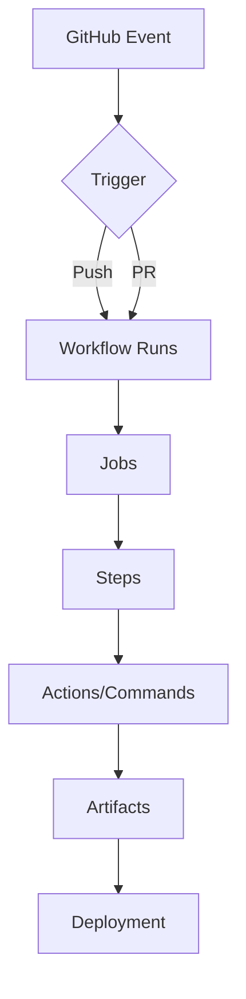

# Mastering GitHub Actions: a comprehensive guide for DevOps and developers

## Introduction
GitHub Actions has revolutionized the way developers automate, build, test, and deploy software by providing a powerful native CI/CD tool integrated directly into GitHub. This comprehensive guide will help you master GitHub Actions from the ground up, whether you're a developer, DevOps engineer, or technical founder.

## What you'll learn in this guide
- [What is GitHub Actions and why should you care?](#what-is-github-actions-and-why-should-you-care)
- [Let's get started with your first workflow](#lets-get-started-with-your-first-workflow)
- [How to build advanced workflows](#how-to-build-advanced-workflows)
- [Keeping your workflows secure](#keeping-your-workflows-secure)
- [Real-world examples to inspire you](#real-world-examples-to-inspire-you)
- [Wrapping up and next steps](#wrapping-up-and-next-steps)

## What is GitHub Actions and why should you care?

> 🔧 **Think of GitHub Actions like...** an automated factory inside your code repository. Just as a factory uses assembly lines to transform raw materials into finished products, GitHub Actions transforms your code commits into tested, built, and deployed applications - all automatically!

GitHub Actions is a CI/CD automation tool that enables you to create custom workflows triggered by GitHub events such as:
- Push events
- Pull requests
- Issue creation
- Manual triggers

### Why GitHub Actions is worth your time
- **Native GitHub Integration**: Seamless workflow with your existing GitHub repositories
- **Declarative Configuration**: Easy-to-understand YAML-based workflow definitions
- **Docker Support**: Container-based execution environments
- **Matrix Builds**: Parallel testing across multiple configurations
- **Free for Public Repositories**: Cost-effective for open-source projects

### Understanding the basics

```
┌────────────┐     ┌────────────┐     ┌────────────┐
│   Events   │────►│  Workflows │────►│    Jobs    │
└────────────┘     └────────────┘     └────────────┘
                                           │
                                           ▼
┌────────────┐     ┌────────────┐     ┌────────────┐
│  Artifacts │◄────│   Actions  │◄────│    Steps   │
└────────────┘     └────────────┘     └────────────┘
```

1. **Workflow**: A YAML file defining your automation process (like a recipe)
2. **Job**: An independent section of a workflow (like dishes in a meal)
3. **Step**: Individual commands or actions in a job (like cooking instructions)
4. **Action**: Reusable pre-built tasks (like pre-made ingredients)

> 💡 **Pro tip**: Think of GitHub Actions workflows as LEGO sets - you can create simple structures with a few blocks or complex masterpieces by combining many different pieces!

## Let's get started with your first workflow

### 🛠️ Try this: your first GitHub Action

Create a simple workflow file at `.github/workflows/hello.yml`:

```yaml
name: Hello Workflow
on:
  push:
    branches: [main]

jobs:
  say-hello:
    runs-on: ubuntu-latest
    steps:
      - name: Print greeting
        run: echo "👋 Hello from GitHub Actions!"
```

> **✅ Challenge 1**: After creating this file, push it to your repository's main branch and navigate to the "Actions" tab to see your workflow run!

### Understanding workflow components
- `on`: Defines the trigger conditions (like buttons that start a machine)
- `jobs`: Contains named workflow sections (like separate workstations)
- `steps`: Executes commands or uses GitHub Actions (like detailed instructions)

## How to build advanced workflows

### Running multiple jobs in your workflow

> 🏗️ **Real-world analogy**: Building an application is like constructing a house - you need to lay the foundation (build) before you can check the electrical systems (test).

```yaml
jobs:
  build:
    runs-on: ubuntu-latest
    steps:
      - run: echo "🏗 Building..."

  test:
    needs: build
    runs-on: ubuntu-latest
    steps:
      - run: echo "✅ Testing..."
```

### Setting up common triggers
```yaml
on:
  push:
    branches: [main]
  pull_request:
    branches: [main]
  workflow_dispatch:
```

> 💡 **Pro tip**: The `workflow_dispatch` trigger is like having a manual override button - useful when you need to run workflows on demand!

### Using matrix builds for parallel testing

> 🧩 **Visual concept**: Think of matrix builds like parallel universes - the same code being tested in different environments simultaneously.

```yaml
strategy:
  matrix:
    node: [14, 16, 18]
```

> **🔍 Try this**: Expand your matrix to include different operating systems:
```yaml
strategy:
  matrix:
    node: [14, 16, 18]
    os: [ubuntu-latest, windows-latest, macos-latest]
```

## Keeping your workflows secure

### How to manage secrets safely

> 🔒 **Think of secrets like...** keys to your house. You'd never leave them under the doormat where anyone can find them!

```yaml
env:
  API_KEY: ${{ secrets.API_KEY }}
```

> ⚠️ **Security warning**: Always use secret variables for sensitive information. Never hardcode credentials in your workflow files!

### Speeding up workflows with caching

> 🚀 **Real-world analogy**: Caching is like meal prepping for the week - you do the work once, then reuse it to save time later.

```yaml
- uses: actions/cache@v3
  with:
    path: ~/.npm
    key: ${{ runner.os }}-node-${{ hashFiles('**/package-lock.json') }}
```

### Managing build artifacts

> 📦 **Think of artifacts like...** shipping pallets in a warehouse - they're how you package and store the products of your work.

```yaml
- uses: actions/upload-artifact@v3
  with:
    name: build-files
    path: dist/
```

## How GitHub Actions works behind the scenes



## Real-world examples to inspire you

> 🚀 **Success story**: A fintech startup reduced their deployment times from 2 hours to just 10 minutes by automating their entire testing and deployment pipeline with GitHub Actions.

### Deploying your website to S3
```yaml
- name: Deploy to S3
  run: aws s3 sync ./build s3://your-bucket --delete
```

### Deploying to EC2 using SSH
```yaml
- uses: appleboy/ssh-action@v1
  with:
    host: ${{ secrets.EC2_HOST }}
    username: ec2-user
    key: ${{ secrets.EC2_KEY }}
    script: |
      cd /app && git pull && pm2 restart app
```

### Building and pushing Docker images
```yaml
- name: Docker Push
  run: |
    docker build -t your-image .
    docker push your-image
```

### Deploying infrastructure with Terraform
```yaml
- uses: hashicorp/setup-terraform@v2
- run: terraform init && terraform apply -auto-approve
```

> **✅ Hands-on exercise**: Try creating a workflow that combines multiple deployment steps, such as building a Docker image and then deploying it to a cloud provider.

## Pro tips to make your workflows better

1. **Organizing your workflows**
   - Use `workflow_dispatch` for manual triggers
   - Implement matrix builds for version testing
   - Set up environment-specific configurations

2. **Keeping things secure**
   - Store credentials in GitHub Secrets
   - Rotate tokens regularly
   - Implement least privilege IAM roles

3. **Making workflows faster**
   - Leverage caching for dependencies
   - Optimize workflow execution time
   - Use artifacts for build outputs

> 💎 **Hidden gem**: You can use GitHub Actions to automatically merge dependabot pull requests after tests pass!

## Wrapping up and next steps

This guide has covered the essential aspects of GitHub Actions, from basic concepts to advanced deployment scenarios. You now have the knowledge to:
- Create scalable automation workflows
- Implement secure deployment pipelines
- Manage complex multi-job processes
- Deploy to various cloud platforms

### What to explore next
- Explore monorepo workflows
- Implement Terraform pipelines
- Set up OIDC deployments to AWS
- Share this knowledge with your team

## 🔥 Challenge: build your own CI/CD pipeline

Now that you've learned the fundamentals, try building a complete CI/CD pipeline that:
1. Runs tests on pull requests
2. Builds and publishes artifacts on merges to main
3. Deploys to a staging environment automatically
4. Includes a manual approval step for production deployments

Share your workflow on Twitter with #GitHubActionsChallenge!

## About the author

**Glenn Allogho** is a Tech Innovator & Software Engineer with a passion for creating innovative digital solutions. As a versatile tech entrepreneur, he has successfully launched and led multiple projects ranging from SaaS applications to AI-driven tools.

### Professional background
- Full-stack development expertise across frontend, backend, and cloud infrastructure
- Specialized in transforming complex ideas into intuitive digital products
- Proven track record in developing solutions that address real-world challenges

### Connect with the author
- 🌐 [Personal Website](https://glenn.allinsoftware.io/)
- 📧 Email: glennfreelance365@gmail.com
- 💼 [LinkedIn](https://www.linkedin.com/in/glenn-allogho-94649688/)
- 📝 [Medium](https://medium.com/@glennlenormand)
- 🐦 [Twitter](https://x.com/glenn_all)
- 💻 [GitHub](https://github.com/allglenn)

---

*Last updated: [Current Date]*

**Tags**: GitHub Actions, CI/CD, DevOps, Automation, Cloud Deployment, Infrastructure as Code

