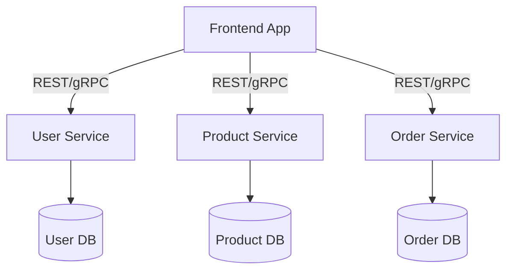
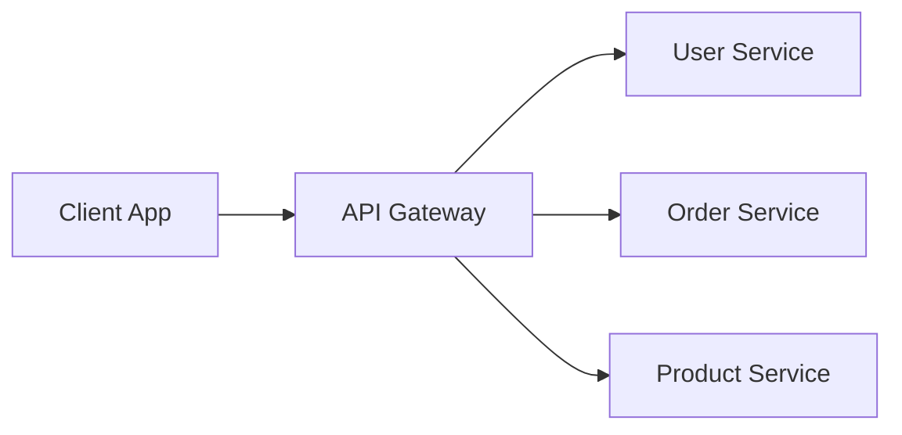
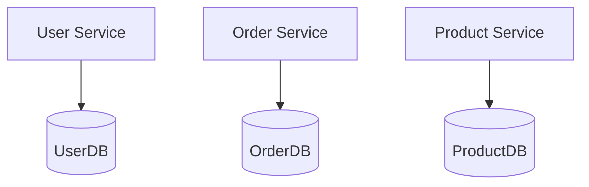
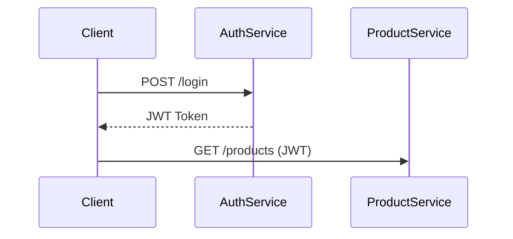
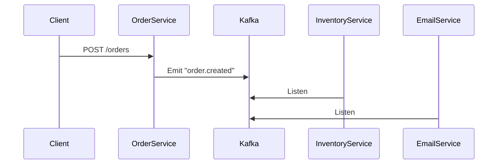
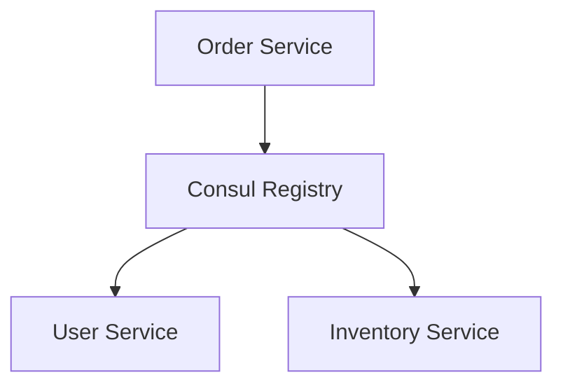
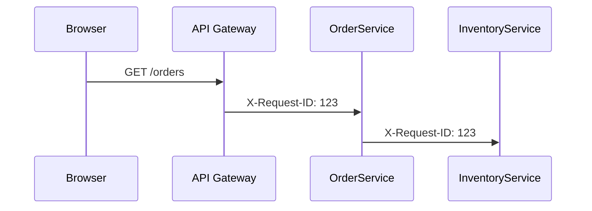
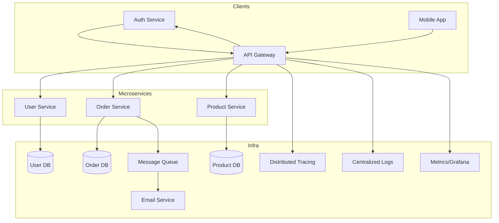

# Mastering Microservices Architecture: A Crash Course from Zero to Architect

[Microservices](#what-are-microservices) are more than a buzzword — they are the engine behind scalable, resilient, and independent systems powering modern apps. In this crash course, you'll go from zero to microservices hero in under 30 minutes.

## What You'll Learn

- What [microservices architecture](#what-are-microservices) is and why it matters
- [Communication](#service-communication-api-gateway--dbs), [API gateways](#api-gateway), and [per-service databases](#db-per-service)
- [Auth](#central-auth-service--jwt), [message queues](#message-queues-async), and [circuit breakers](#circuit-breakers)
- [Service discovery](#service-discovery), [observability](#observability-stack), and [scaling](#scaling-services)

By the end, you'll understand not just the what, but the why and how — with diagrams and examples you can reuse.

## What Are Microservices?

### Microservices 101

Microservices are small, independent services that talk over the network and each handle a specific domain or responsibility. Unlike [monolithic applications](#monolith-vs-microservices) where all functionality is packaged into a single unit, microservices break down applications into smaller, focused components.

Each microservice:
- Owns a specific business capability or domain
- Is independently deployable without affecting other services
- Communicates via well-defined APIs or [message queues](#message-queues-async)
- Can be developed, scaled, and maintained by separate teams
- Can be written in different programming languages based on requirements

This architectural approach has gained significant traction because it aligns with modern development practices and business needs for rapid, independent evolution of different application components.

### Monolith vs Microservices

| Monolith | Microservices |
|----------|---------------|
| Single codebase | Independent services |
| One database | [Database per service](#db-per-service) |
| Harder to scale | [Individually scalable](#scaling-services) |
| Tight coupling | Loose coupling |
| Simpler initial setup | More complex infrastructure |
| Simple deployment | Orchestration required |
| Limited technology choices | Freedom to use best tool for each service |
| Risk of becoming a "big ball of mud" | Clear boundaries between services |

**When to choose microservices:** Consider microservices when you need independent scaling, technology flexibility, more frequent deployments, or have distinct business domains that can evolve independently.

**When to avoid microservices:** For smaller applications, proof-of-concepts, or when your team lacks experience with distributed systems, a monolith might be more appropriate to start with.

### Key Features

- Single-responsibility per service
- Communication via [API](#service-communication-api-gateway--dbs) or [queue](#message-queues-async)
- Independent [scaling](#scaling-services) & deployment
- Language-agnostic development
- Resilience through isolation
- [Domain-driven design](https://martinfowler.com/bliki/DomainDrivenDesign.html) principles
- Decentralized data management
- Infrastructure automation

### Basic Architecture



In this basic architecture:
- **Frontend App**: Single-page application or mobile app that interfaces with services
- **User Service**: Handles user authentication, profiles, and permissions
- **Product Service**: Manages product catalog, inventory, and pricing
- **Order Service**: Processes customer orders, payment, and fulfillment
- **Databases**: Each service has its own database, ensuring loose coupling

## Service Communication, API Gateway & DBs

### Communication Patterns

- **Synchronous**: [HTTP/REST](https://restfulapi.net/) or [gRPC](https://grpc.io/) (real-time)
  - REST: Simple, widely adopted, human-readable
  - gRPC: Efficient binary protocol, strong typing with Protocol Buffers
  
- **Asynchronous**: [Message queues](#message-queues-async) (event-driven)
  - Publish/Subscribe: Services publish events that others subscribe to
  - Command/Query: Separate write and read operations

**Synchronous Example**: 
```
// REST API call
GET /api/users/123
```

**Asynchronous Example**:
```json
// Event published to message queue
{
  "event": "OrderCreated",
  "payload": {
    "orderId": "ord-12345",
    "userId": "usr-789",
    "items": [...]
  }
}
```

The choice between synchronous and asynchronous communication has significant implications for your system's coupling, resilience, and complexity. Synchronous calls are simpler but create direct dependencies, while asynchronous patterns provide better resilience but introduce eventual consistency challenges.

### API Gateway

- Routes external traffic to services
- Handles [auth](#central-auth-service--jwt), rate limits, and logging
- Provides a single entry point for clients
- Can transform requests/responses
- Implements cross-cutting concerns
- Hides internal service structure



Popular API Gateway solutions include:
- **[Kong](https://konghq.com/)**: Open-source, extensible through plugins
- **[Amazon API Gateway](https://aws.amazon.com/api-gateway/)**: Managed service with AWS Lambda integration
- **[NGINX/OpenResty](https://openresty.org/)**: High-performance, configurable proxy
- **[Spring Cloud Gateway](https://spring.io/projects/spring-cloud-gateway)**: Java-based, reactive gateway
- **[Traefik](https://traefik.io/)**: Modern, cloud-native edge router

An API Gateway is crucial for a production microservices architecture as it centralizes cross-cutting concerns like security, monitoring, and rate limiting.

### DB per Service

Avoid shared DBs. Each service should manage its own data:



This approach, known as the Database-per-Service pattern, brings several benefits:

1. **Independent scaling**: Each database can be sized according to the service's needs
2. **Technology flexibility**: Use the right database for each service (SQL, NoSQL, graph, etc.)
3. **Isolation**: Issues in one database don't affect other services
4. **Clear ownership**: Each team owns their service's data model

However, this pattern introduces challenges:
- **Data consistency**: Maintaining consistency across services requires careful design
- **Distributed transactions**: Traditional ACID transactions across services become difficult
- **Data duplication**: Some data may need to be duplicated across services
- **Query complexity**: Joining data across services requires API composition

To address these challenges, patterns like [CQRS](https://martinfowler.com/bliki/CQRS.html) (Command Query Responsibility Segregation) and [Event Sourcing](https://martinfowler.com/eaaDev/EventSourcing.html) are often employed in microservice architectures.

## Auth, Message Queues, Circuit Breakers

### Central Auth Service + JWT



In this authentication flow:
1. The client authenticates against a central Auth Service
2. Upon successful authentication, the Auth Service issues a [JWT token](https://jwt.io/)
3. The client includes this token in subsequent requests to other services
4. Each service validates the token independently (no network call needed)

A typical JWT structure contains:
```
Header: { "alg": "RS256", "typ": "JWT" }
Payload: {
  "sub": "user123",
  "name": "John Doe",
  "roles": ["customer"],
  "exp": 1588330267
}
Signature: HMAC-SHA256(base64UrlEncode(header) + "." + base64UrlEncode(payload), secret)
```

For enhanced security:
- Use short-lived tokens (15-60 minutes)
- Implement refresh token flows
- Store sensitive user data in service databases, not in tokens
- Consider using a public/private key pair rather than shared secrets
- Implement token revocation strategies

### Message Queues (Async)

- Decouple services
- Enable retries and scalability
- Handle spikes in load
- Provide a buffer between services
- Support multiple subscribers per message
- Allow for event-driven architectures



Popular message queue technologies:
- **[Kafka](https://kafka.apache.org/)**: High-throughput distributed streaming platform
- **[RabbitMQ](https://www.rabbitmq.com/)**: Feature-rich, supports multiple messaging protocols
- **[Amazon SQS/SNS](https://aws.amazon.com/sqs/)**: Managed queuing and pub/sub services
- **[Google Pub/Sub](https://cloud.google.com/pubsub)**: Scalable, globally available messaging service
- **[NATS](https://nats.io/)**: Lightweight, high-performance messaging system

Implementation considerations:
- Choose between point-to-point or publish-subscribe patterns
- Design for idempotency (safe message redelivery)
- Implement dead-letter queues for failed messages
- Consider message schemas and versioning
- Plan for message ordering when required

### Circuit Breakers

- Prevent cascading failures
- Temporarily cut off slow/failing services
- States: closed → open → half-open → closed
- Tools: [Hystrix](https://github.com/Netflix/Hystrix), [Resilience4j](https://github.com/resilience4j/resilience4j), [Polly](https://github.com/App-vNext/Polly), [Istio](https://istio.io/)

Circuit breakers are a critical pattern for building resilient microservices. They work like electrical circuit breakers, cutting off the flow when problems are detected.

**States explanation:**
1. **Closed**: Normal operation, requests flow through
2. **Open**: When failure threshold is reached, circuit opens and fast-fails requests
3. **Half-open**: After a timeout, allows limited traffic to test if the service recovered
4. **Closed again**: If test requests succeed, normal operation resumes

**Configuration parameters:**
- Failure threshold (e.g., 50% failure rate)
- Timeout period (e.g., 5 seconds per request)
- Reset timeout (e.g., try again after 30 seconds)
- Volume threshold (e.g., minimum 10 requests)

Sample implementation with Resilience4j (Java):
```java
CircuitBreakerConfig config = CircuitBreakerConfig.custom()
    .failureRateThreshold(50)
    .waitDurationInOpenState(Duration.ofMillis(1000))
    .permittedNumberOfCallsInHalfOpenState(10)
    .slidingWindowSize(100)
    .build();

CircuitBreaker circuitBreaker = CircuitBreaker.of("orderService", config);
```

## Discovery, Observability & Scaling

### Service Discovery



Service discovery solves a fundamental problem in dynamic microservice environments: how services find and communicate with each other when IP addresses and ports may change frequently.

**How it works:**
1. Services register themselves with the discovery service on startup
2. They provide metadata like service name, address, port, health check URL
3. Consumers query the discovery service to find available instances
4. The discovery service may provide load balancing capabilities

**Implementation approaches:**
- **Client-side discovery**: Clients query registry directly and choose an instance
- **Server-side discovery**: A router/load balancer sits between client and services

Popular service discovery tools:
- **[Consul](https://www.consul.io/)**: Feature-rich with health checking and DNS interface
- **[etcd](https://etcd.io/)**: Distributed key-value store used by Kubernetes
- **[Eureka](https://github.com/Netflix/eureka)**: Java-based solution from Netflix
- **[Kubernetes Service](https://kubernetes.io/docs/concepts/services-networking/service/)**: Native service discovery in Kubernetes
- **[ZooKeeper](https://zookeeper.apache.org/)**: Distributed coordination service

### Observability Stack

| Layer | Tools |
|-------|-------|
| Logs | [Fluentd](https://www.fluentd.org/), [Loki](https://grafana.com/oss/loki/), [ELK](https://www.elastic.co/elastic-stack) |
| Metrics | [Prometheus](https://prometheus.io/) + [Grafana](https://grafana.com/) |
| Tracing | [Jaeger](https://www.jaegertracing.io/), [Zipkin](https://zipkin.io/), [OpenTelemetry](https://opentelemetry.io/) |

In microservices, traditional debugging becomes nearly impossible. Observability is not just monitoring—it's about making the system's internal state understandable through external outputs.

The three pillars of observability:

**1. Logs**: Event records from individual services
- Structured logging is essential (JSON format)
- Centralize with tools like ELK Stack (Elasticsearch, Logstash, Kibana) or Loki
- Include contextual information like request IDs

**2. Metrics**: Numerical data about system behavior
- Key metrics: request rate, error rate, latency ([RED method](https://grafana.com/blog/2018/08/02/the-red-method-how-to-instrument-your-services/))
- Use dimensional metrics for flexible querying
- Set up alerts on abnormal patterns

**3. Distributed Tracing**: Following requests across services
- Propagate trace context between services
- Sample traces to reduce overhead
- Analyze end-to-end performance and bottlenecks

Track requests via X-Request-ID header across services.



Sample tracing implementation with OpenTelemetry:
```java
// Create a span
Span orderProcessingSpan = tracer.spanBuilder("ProcessOrder")
    .setParent(Context.current().with(parentSpan))
    .setAttribute("orderId", orderId)
    .startSpan();

try (Scope scope = orderProcessingSpan.makeCurrent()) {
    // Business logic
    processPayment();
    updateInventory();
    notifyShipping();
} catch (Exception e) {
    orderProcessingSpan.setStatus(StatusCode.ERROR);
    orderProcessingSpan.recordException(e);
    throw e;
} finally {
    orderProcessingSpan.end();
}
```

### Scaling Services

- Stateless design = easy replication
- Externalize state (DB, [Redis](https://redis.io/), [S3](https://aws.amazon.com/s3/))
- Auto-scale based on traffic
- Design for horizontal scaling
- Consider data locality for performance
- Implement proper caching strategies

| Platform | Auto-scaling Tool |
|----------|------------------|
| [AWS ECS/EKS](https://aws.amazon.com/eks/) | CloudWatch + ASG |
| [Kubernetes](https://kubernetes.io/) | [HPA](https://kubernetes.io/docs/tasks/run-application/horizontal-pod-autoscale/) (Horizontal Pod Autoscaler) |
| [Docker Swarm](https://docs.docker.com/engine/swarm/) | Replicas |
| [Azure AKS](https://azure.microsoft.com/en-us/services/kubernetes-service/) | [KEDA](https://keda.sh/) |
| [Google GKE](https://cloud.google.com/kubernetes-engine) | HPA or custom metrics |

**Scaling strategies:**
1. **Horizontal scaling**: Add more instances of a service
2. **Vertical scaling**: Increase resources for existing instances
3. **Functional sharding**: Split service by functionality
4. **Data sharding**: Partition data to distribute load

**Scaling patterns:**
- **Predictive scaling**: Scale before anticipated load
- **Reactive scaling**: Scale based on current metrics
- **Scheduled scaling**: Scale based on time patterns
- **Manual scaling**: For planned events or maintenance

Sample Kubernetes HPA configuration:
```yaml
apiVersion: autoscaling/v2
kind: HorizontalPodAutoscaler
metadata:
  name: order-service-hpa
spec:
  scaleTargetRef:
    apiVersion: apps/v1
    kind: Deployment
    name: order-service
  minReplicas: 3
  maxReplicas: 10
  metrics:
  - type: Resource
    resource:
      name: cpu
      target:
        type: Utilization
        averageUtilization: 80
```

### Final Template – Full Architecture



This architecture represents a mature microservices implementation with:

1. **Multiple clients**: Web and mobile applications sharing services
2. **[API Gateway](#api-gateway)**: Single entry point for external clients
3. **Core services**: User, Order, Product, and Auth services
4. **[Database per service](#db-per-service)**: Independent data stores
5. **[Asynchronous communication](#message-queues-async)**: Message queue for event-driven flows
6. **[Observability stack](#observability-stack)**: Tracing, logging, and metrics

## Implementation Roadmap

When transitioning to microservices, a phased approach is recommended:

1. **Start with a monolith**: For new projects, begin with a modular monolith
2. **Identify boundaries**: Use [Domain-Driven Design](https://martinfowler.com/bliki/DomainDrivenDesign.html) to find service boundaries
3. **Extract services gradually**: Begin with less critical, well-bounded services
4. **Build supporting infrastructure**: API gateway, service discovery, etc.
5. **Implement observability**: Ensure you can monitor the distributed system
6. **Standardize patterns**: Create internal libraries or templates for common concerns
7. **Automate deployments**: [CI/CD pipelines](https://github.com/features/actions) are essential for microservices
8. **Develop operational expertise**: Teams need to operate what they build

Remember that microservices architecture comes with trade-offs. The increased complexity is justified only when the benefits of independent scaling, deployment, and team autonomy are needed.

## Conclusion: Why Microservices?

- Modular, testable, scalable systems
- Deploy independent components
- Tech stack flexibility and autonomy
- Enable fast-moving dev teams
- Better resilience and fault isolation
- Easier to understand smaller codebases
- Align technical teams with business domains
- Support organization scaling

However, microservices aren't a silver bullet. They introduce complexity, require strong [DevOps](https://aws.amazon.com/devops/what-is-devops/) practices, and can lead to distributed system challenges. Start with clear goals and understand the organizational and technical prerequisites for success.

The right architecture is the one that solves your specific problems within your constraints—sometimes that's microservices, sometimes it's not.

## Further Learning

- [Docker](https://www.docker.com/) & [Kubernetes](https://kubernetes.io/) for Microservices
- [Kafka](https://kafka.apache.org/) for Event-Driven Architecture
- [GitHub Actions](https://github.com/features/actions) for Microservice CI/CD
- [Domain-Driven Design](https://martinfowler.com/bliki/DomainDrivenDesign.html) principles
- [Resilience patterns](https://docs.microsoft.com/en-us/azure/architecture/patterns/category/resiliency) for distributed systems
- [API design](https://swagger.io/resources/articles/best-practices-in-api-design/) best practices

What do you want to learn next about microservices architecture?

---

## About the author

**Glenn Allogho** is a Tech Innovator & Software Engineer with a passion for creating innovative digital solutions. As a versatile tech entrepreneur, he has successfully launched and led multiple projects ranging from SaaS applications to AI-driven tools.

### Professional background
- Full-stack development expertise across frontend, backend, and cloud infrastructure
- Specialized in transforming complex ideas into intuitive digital products
- Proven track record in developing solutions that address real-world challenges

### Connect with the author
- 🌐 [Personal Website](https://glenn.allinsoftware.io/)
- 📧 Email: glennfreelance365@gmail.com
- 💼 [LinkedIn](https://www.linkedin.com/in/glenn-allogho-94649688/)
- 📝 [Medium](https://medium.com/@glennlenormand)
- 🐦 [Twitter](https://x.com/glenn_all)
- 💻 [GitHub](https://github.com/allglenn)

